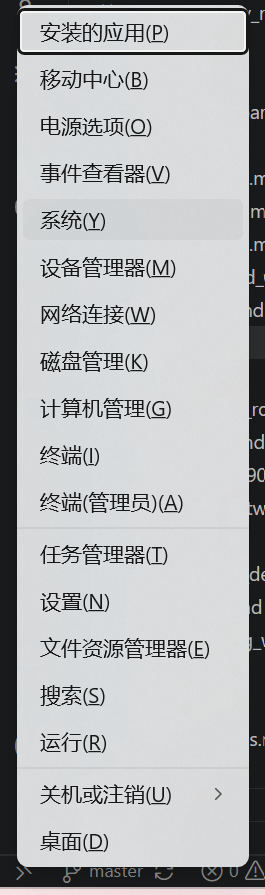
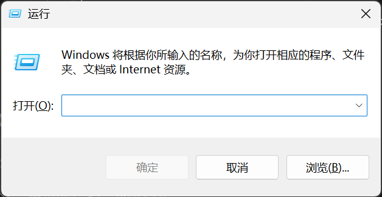
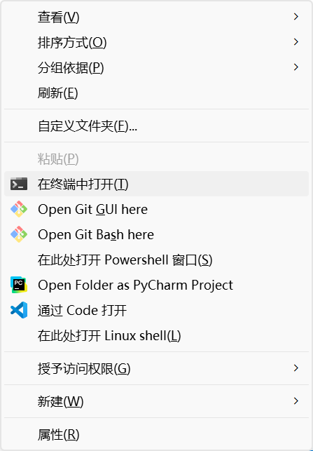
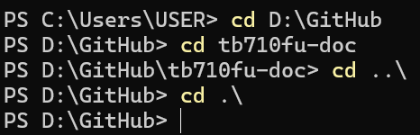

# 命令行入门

不保证对，保证在 Windows 10 和 11 上进行的刷机工作中能用就行。

本教程介绍本站其他教程所需的最基本的命令行知识，如果你已经或多或少知道怎么打开命令提示符和 Powershell 一类的终端了，我推荐你从 [终端命令的潜规则](#终端命令的潜规则) 开始阅读。

命令行是使用文本指令和计算机交互的一种方式。

## 终端

终端是使用命令行进行工作的地方，早期计算机具备专门的电传打字机等工具来作为命令行交互的“界面”，是货真价实的终端。现代计算机具备的“命令提示符”等工具是终端模拟器。

在 Windows 系统上，常用的终端模拟器包括：

1. 命令提示符 (Command Prompt, 简称 CMD)
2. Windows Powershell 提供的终端模拟器(简称 PS)
3. Windows 终端 (Windows Terminal，Windows 11 自带)
4. Git Bash (提供部分 UNIX 风格的命令)
5. 各种编程工具提供的终端模拟器，例如 Visual Studio Code 和 JetBrains 系列工具
6. Linux 子系统 (Windows Subsystem for Linux) 提供的 Bash 终端

## 选择一个好的终端模拟器

建议所有 Windows 10 和 11 用户选择 “Windows 终端”，它原生支持 ANSI 序列（提供彩色字符等功能）、支持 GPU 加速文本渲染（显示更舒适更流畅）。

如果没法使用 Windows 终端，其他几个常见终端实现的推荐顺序为：

``` text
PowerShell = Git Bash = WSL Bash > 编程工具提供的终端 >> 命令提示符
```

## 打开终端模拟器

如果电脑上安装了合适的终端模拟器，可以通过以下几种方式打开它。

### 使用超级菜单

Windows 会选择一个它认为合适的终端模拟器作为默认终端。要打开这个默认终端可以使用下面的方式：

1. 按快捷键 `Win + X` ，打开超级菜单后选择 `终端`、`Windows PowerShell` 或者 `命令提示符`
   > [!tip]
   > 包含 `管理员` 字样的选项，例如 `终端 (管理员)` 用于需要提升权限的操作，比如修改注册表。通常来说不需要使用。

   

2. 终端窗口会在一段时间后弹出，一般来说是底色为黑色或者蓝色的一个窗口，部分时候需要等待终端本身初始化，显示像下面这样的文本信息：
   ``` text
   Windows PowerShell
   版权所有（C） Microsoft Corporation。保留所有权利。
   ```
3. 现在可以使用终端了。

### 使用“运行”启动终端

这个办法可以启动所有已经在你系统上安装了的终端模拟器。

1. 按下 `Win + R` 打开“运行”
   
2. 输入要使用的终端名字，命令提示符是 `cmd` ，如果要使用 PowerShell 则输入 `powershell`
3. 如果输入无误，系统会打开终端窗口，否则将提示找不到文件
4. 等待终端加载完毕即可使用

> [!tip]
> 可以输入绝对路径，例如 `C:\Program Files\Git\git-bash.exe` 来直接启动一个 `.exe` 可执行文件。这里提供的路径是作者电脑上安装的 Git Bash 终端模拟器所在的位置。

### 在资源管理器中启动终端

这个办法可以在当前工作目录启动非管理员权限的终端。

1. 在 `此电脑` 中导航到希望打开终端的文件夹页面中
2. 按住键盘上的 `Shift` 键，然后按下鼠标右键
3. 会打开下图中的上下文菜单，选择`在此处打开 Windows Powershell` 或者包含其他终端名字的选项
   
4. 等待终端加载完毕即可使用

## 使用终端命令

最常用的命令是 adb 和 fastboot ，需要电脑上提前 [安装 ADB 工具](./flash_unlocked_device.md#安装-adb-工具) 。下面提供一些示例，更多用法请参考命令的 help 信息：

- `adb help` 查看 adb 支持哪些命令，**请善用翻译和 AI 工具理解命令的意思**
- `adb reboot` 重启设备
- `adb reboot bootloader` 重启到 Bootloader 模式
- `adb reboot recovery` 重启到 Recovery 模式
- `adb reboot edl` 重启到 9008 模式
- `adb reboot fastboot` 重启到 FastbootD
- `adb shell` 进入设备的 Shell 终端（一个类 UNIX 终端环境）
- `adb devices` 查看连接到电脑的设备
- `fastboot help` 查看 fastboot 支持哪些命令，**请善用翻译和 AI 工具理解命令的意思**
- `fastboot devices` 查看连接到电脑的 fastboot 设备
- `fastboot flash <partition_name> <image_name>` 将镜像刷入指定分区
- `fastboot erase <partition_name>` 将指定分区擦除
- `fastboot -w` 格式化用户数据分区，包括 userdata 和 metadata

## 终端命令的潜规则

在 `--help` 或文档中经常看到各种符号，它们的含义如下：

**`<>` 尖括号** — 占位符，表示你必须替换成实际的值。例如 `fastboot flash <partition_name> <image_name>` 中的 `<partition_name>` 意思是输入你要刷的分区名字（如 `boot`），而不是真的输入 `<partition_name>` 这几个字符。

**`[]` 方括号** — 表示里面的内容是**可选的**，可以写也可以不写。例如 `ls [-alrtAFR] [name]` 表示 `-a`、`-l` 这些参数都可选。

**Subcommand（子命令）** — 跟在主命令后面的动词，表示具体要做什么。例如 `adb shell` 中的 `shell`、`git remote add` 中的 `remote` 和 `add` ，这些都是子命令。

**旗标/选项（Flag/Option）** — 以 `-` 或 `--` 开头的参数，用于修改命令的行为。例如 `adb -s <设备序列号> shell` 中的 `-s` 就是一个选项。

**`--` 双减号** — 在 Linux/UNIX 风格的命令中表示长选项（如 `--help`），在部分命令中也用于标记后续参数的类型。

**`/` 正斜杠** - Windows 原生命令（如 `dir`、`copy`）通常用 `/` 而不是 `--` 来表示一个选项。

**`|` 管道符（在帮助文档中）** — 表示“或”，即 `|` 两边的参数任选其一。例如 `{ -l | -r | -e }` 表示 `-l`、`-r`、`-e` 三选一。

**`{}` 大括号** — 表示括号内的参数任选其一。不过在帮助文档中比较少见，更多时候用 `|` 来表达同样的意思。

**`()` 圆括号** — 通常用于分组，表示括号内的内容是一个整体。在某些文档中，`()` 也表示必选组合。

**`...` 省略号** — 表示前面的参数可以重复多次。例如 `which [文件...]` 表示你可以一次性查多个文件的位置。

> [!tip]
> 写命令的时候要去掉 `<>`、`[]`、`{}` 这些符号本身，只输入里面的内容。例如 `fastboot flash <partition_name> <image_name>` 实际应该写成 `fastboot flash boot boot.img`。

## 路径

文件系统是棵树，叶子是各种文件，文件夹组成树的枝杈。

路径就是从树根（绝对路径）或者某个枝杈/叶片（相对路径）开始 *需要依次经过哪些枝杈到达哪一片叶子* 的记法。

1. 绝对路径：从盘符（Windows）或根目录（Linux/Mac）开始写起的完整路径。

- Windows 示例：`C:\Users\你的用户名\Downloads\boot.img`
- 注意 Windows 用反斜杠 `\`

2. 相对路径：相对于“当前工作目录”（当前工作目录是命令行中 `>` 符号左侧的那串东西，见图）的路径。

- `.` 表示当前目录
- `..` 表示上级目录

下面的例子中使用 `cd` 命令切换目录来展示上一级目录和本目录的相对路径语法以及工作目录的变化。



通常需要在涉及文件的命令和选项中输入 `.\` (Windows) 或者 `./` (Linux 或者 Python 等跨平台应用)，来确保访问当前目录下的文件而不报错。

例如：

- `python3 ./avbtool.py info_image --image ./boot.img` 用当前目录下的 avbtool.py 读取当前目录下的 boot.img 的 AVB 信息。
- `.\\.venv\Scripts\activate` Windows 环境中使用当前目录下 `.venv` 目录中 `Scripts` 文件夹的 `activate` 脚本激活 Python 虚拟环境

### 为什么文件明明存在却提示“找不到”？

主要有以下几种原因：

1. 当前工作目录不对 — 你输入文件名时，系统只会在**当前目录**下找这个文件。如果你在 `C:\` 目录下输入 `adb`，但 `adb.exe` 在 `D:\tools\` 里，系统当然找不到。
2. 路径中有空格或特殊字符 — 如果路径包含空格（如 `Program Files`），需要用引号括起来：`"C:\Program Files\SomeTool\tool.exe"`。
3. 没有添加到 PATH — 这是最常见的原因，详见下一节。

**解决方案**：要么使用绝对路径（如 `C:\Users\你的用户名\adb.exe`），要么先 `cd` 切换到文件所在的目录再执行。

## PATH 环境变量

**PATH 是什么？**

PATH 是操作系统里的一个系统级配置，它的核心功能是告诉系统**去哪里找可执行程序**。当你在终端输入一个命令（比如 `adb`）时，系统会按照 PATH 中列出的目录顺序依次查找，直到找到对应的 `.exe` 文件。

**怎么查看 PATH？**

在命令提示符或 PowerShell 中输入：

```cmd
echo %PATH%
```

系统会显示一串用分号 `;` 分隔的目录列表。

**怎么添加路径到 PATH？**

1. 右键“此电脑” → 属性 → 高级系统设置 → 环境变量
2. 在“系统变量”或“用户变量”中找到 `Path`，双击编辑
3. 点击“新建”，输入你的工具目录路径（如 `C:\adb`）
4. 确定保存，重新打开终端即可生效

> [!tip]
> 修改 PATH 后需要**重新打开**终端窗口才能生效，已经在运行中的终端不会自动更新。