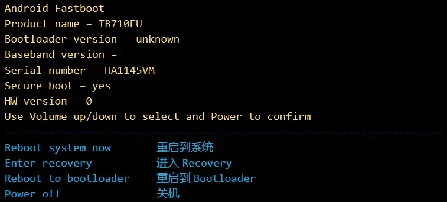
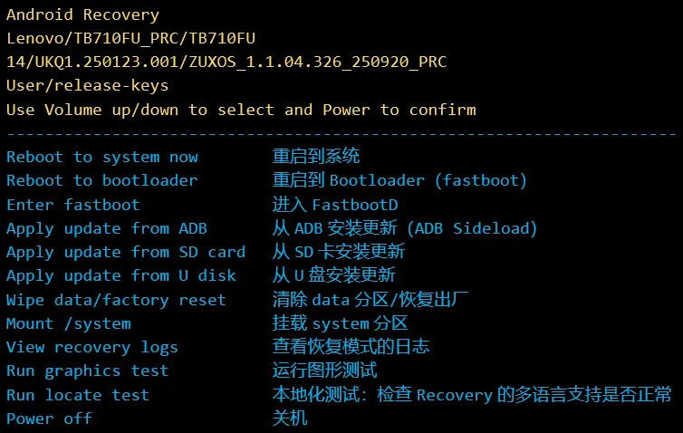
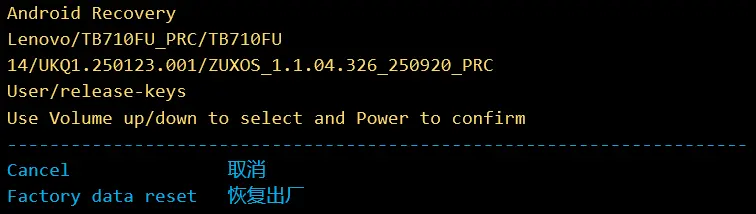
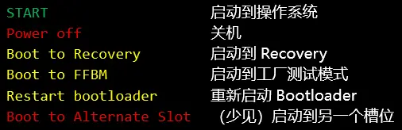

# 术语表

> 请善用搜索功能。尤其是你看到不熟悉的术语出现在引号 `“”` 内的时候。它们通常是这个术语表中的其它条目。
>
> 后文的“设备”指的都是运行安卓操作系统（Android）的设备。如果遇到和“电脑”等辅助装置共同存在的段落，会换用“Android 设备”这个说法着重说明。

## 刷机
把一些和操作系统相关的数据写入某个设备的存储器，从而更改设备操作系统的行为或者更换可以加载的操作系统。以下行为均是刷机：
- 重装 Windows 系统
- 更新电脑 BIOS
- 智能手表、路由器等边缘硬件的软件更新
- 解锁 Android 手机的 Bootloader (什么是 Android, 以及什么是 Bootloader, 后文都有说明，你可以自己查找)
- 在原本运行 Android 的手机上启动 Windows 操作系统
- 在原本运行 iOS 的 iPhone 手机上启动 Android 操作系统
- 给 Android 手机更换一个精简了系统流氓软件的精简版系统软件包
- 将运行小米 HyperOS 的手机更改为运行 OPPO ColorOS

## 刷写
- 义项 1: 把数据写入存储器的过程。
- 义项 2: 见“刷机”。

## 烧录
把数据写入存储器的过程，特指写入“第一次写入后就不能二次写入”的存储器。一个典型的例子是电梯 IC 门禁卡。

另请参见“熔断”

> [!note]
> 从这里开始，所有文本会使用“刷入”、“刷写”这些词替代“写入”这个书面叫法。

## 熔断
把数据写入存储器中。这些数据一旦被写入这个存储器，则不可以再被修改。这么做可以永久打开或者关闭设备上的某个功能，或者配合“防回滚”永久修复某个安全漏洞。

一个很有名的例子是 2025 年末的一加手机熔断事件。你可以在你的 Android 设备上下载 [酷安](https://www.coolapk.com/) （一个中文刷机社区的 APP，它不提供网页版服务），搜索关键词 `一加 熔断` 来了解事件全貌。

## Android
安卓操作系统，来自谷歌的 AOSP(安卓开源计划，提供 Android 操作系统的基础源代码) 经修改而成，重要的移动操作系统。

## AOSP
Android 开放源代码项目（Android Open-Source Project） 是一个开放的源代码操作系统，可在各种设备上运行。

## ADB / 安卓调试桥
`Android Debug Bridge` 的英文简称，用于实现和授权了 `USB 调试` 的 `Android 操作系统` 或 `Recovery` 的交互。比如 `adb reboot edl` 可将设备重启到 `9008 模式` 。

## USB 调试
配合 ADB 使用。如同字面意义，支持对你的 Android 设备做高级调试和开发工作。最常见的有下面这些用途：
1. 安装应用
2. 投屏
3. 重启设备
4. 重启设备到 Bootloader, Recovery, FastbooD 或者深度刷机模式（EDL）
5. 审计设备日志
6. 访问设备的类 UNIX 终端（这很正常，Android 是基于 Linux 创建的，而 Linux 又是一个类 UNIX 操作系统）

## Fastboot
- 义项 1: Android SDK 附带的工具，和同名引导加载程序协同工作，可以刷入镜像。
- 义项 2: Android 正式启动之前用来验证可信环境并加载它的基础设施的一个软件，是 Android 相当底层的部分。
- 义项 3: 社区对 Bootloader 模式的长期错误叫法。因为 Bootloader 模式下很多厂商会在设备屏幕上显示 `FASTBOOT`, 甚至直接显示 `Fastboot Mode` 。

## FastbootD
用户空间 Fastboot 实现，用于操作 `super` 分区，需要解锁 `BootLoader` 才能刷写。

可以使用 `音量键` 浏览 AOSP Fastbootd 下提供的选项，按电源键确认选项。

## Recovery
Android 系统的恢复模式，类似于 Windows 系统的 `WinRE` ，或 Linux 系统的 `LiveCD` 。它提供了基础的存储访问功能，能够访问和修改设备中除了底层固件分区以外的多数分区，并和电脑通信，读取和发送文件。

早期 Android 使用 Recovery 进行 OTA 更新，这个功能在现代 Recovery 中被保留。

厂商提供的 Recovery 会对加载的 OTA 包进行验签，使用非厂商签名的 OTA 包会被拒绝安装。

## AOSP Recovery

来自 Android 开源项目的恢复模式实现，提供基础的功能，联想使用这个 Recovery 。

可以使用 `音量键` 浏览原生 Recovery 下提供的选项，按电源键确认选项（见图）。

配图不是实拍，它们基于实拍图制作并添加了中文翻译。实际使用时， AOSP Recovery 中被选中的选项会被使用 `蓝底白字` 进行*高亮*。

日志内容会出现在 `Recovery 界面的左下角`。

有时候会看到下面的界面，这代表着 `/data` 分区出现了问题，只能格式化（恢复出厂）了。

## TWRP
Team Win Recovery Project, 一个第三方 Recovery 实现，支持刷入自定义固件、浏览设备文件、备份还原分区、使用终端命令等高级功能。

## OFRP
Orange Fox Recovery Project, 外观现代、支持音量键操作的第三方 Recovery 实现。

## Bootloader
引导加载程序，被部分社区成员简称 `bl` 。

> [!warning] 关于简称
> 看得懂即可，请尽量不要使用这个简称来称呼引导加载程序，容易引起不刷机的用户的不必要误会和污名化。

引导加载程序用来验证并加载操作系统。

可以使用 `音量键` 浏览 AOSP BootLoader 下提供的选项，按电源键确认选项。

## Bootloader 锁
保护设备不受未授权软件侵害，该锁锁定状态下 Bootloader 拒绝刷入镜像，并强制启用“AVB 2.0”保护。

简称 `bl 锁`，部分实在偷懒的用户甚至会用 `bl` 直接称呼 Bootloader 锁。

> [!warning] 关于简称
> 看得懂即可，请尽量不要使用这个简称来称呼引导加载程序，容易引起不刷机的用户的不必要误会和污名化。有些时候社区内的用户也会看不明白你希望表达什么。

## 解锁 Bootloader
简称 `解锁`、`解 bl`、`解 bl 锁` 等。刷机社区中常说的 `解锁` 指的就是本义项。

> [!warning] 关于简称
> 看得懂即可，请尽量不要使用这个简称来称呼引导加载程序，容易引起不刷机的用户的不必要误会和污名化。有些时候社区内的用户也会看不明白你希望表达什么。

解锁 Bootloader 可以让你的设备同意在 Bootloader 模式刷入镜像。此外，由于这个操作的初衷是用于开发，解锁 Bootloader 会同时关闭“AVB 2.0”和“dm-verity”来方便测试镜像加载。

对于普通用户，解锁 Bootloader 可以允许你在设备上安装一个未经厂商测试和认可的第三方操作系统。

## 锁定 Bootloader
简称 `回锁` 。锁定 Bootloader 后设备重新强制要求镜像受到厂商授权，并拒绝在 Bootloader 下刷入镜像。因此不能再加载测试镜像，也不能加载未经授权的第三方操作系统。

> [!note] 关于简称
> 回锁这个简称比较准确的反映了操作的含义，适当使用完全没问题。

## 刷机包
可以被刷到设备中的一个特制软件包。可以更改某个软件或者某个系统功能的行为，也可以直接替换你的设备的操作系统。

## 卡刷
把刷机包复制到 SD 卡中，这张 SD 卡可以插到设备中。这样设备就可以读取卡中存储的刷机包，然后使用 Recovery 刷写刷机包。

现在的 Android 设备配置有很大的闪存空间，可以轻松容纳刷机包。卡刷这个词的含义也就发生了变化：把刷机包复制到设备中，然后在设备上利用 Recovery 刷机。

## 线刷
在电脑上准备好刷机包，将 Android 设备用一根数据线连接到电脑上。然后用电脑工具刷机。电脑工具通常是 Fastboot, 其它工具请看“深刷”

## 深刷
通过深度刷机模式或紧急下载模式（EDL, Emergency Download Mode）刷机，是线刷的一个特殊分支。

## 深度刷机模式（深刷模式）
可能指高通设备的 9008 模式（官方工具是 [QPST](https://qpsttool.com/)）或联发科设备的 BootROM 和或 Preloader 模式（官方工具是 [SP Flash](https://spflashtools.com/)）。可以有效修复设备的绝大多数软件故障。

## 卡刷包
适合卡刷操作的特制刷机包。

## 线刷包
适合线刷操作的特制刷机包。

## 卡线一体包
指的是“卡刷/线刷一体包”。经过了特殊设计，可以用于卡刷也可以用于线刷的刷机包。

## 救砖包
用于“救砖”的特制刷机包。通常是“深刷包”。

## 深刷包
深度刷机模式使用的刷机包。通常也是“救砖包”。

## 工程包
设备在工厂出厂前或者返修时会被刷入的测试固件。提供一些消费者无法接触到的高级功能和测试功能。

一些厂商的工程包长期在互联网上泄露，可以自行搜索了解。

## 账号锁
厂商提供的设备保护机制。锁定状态下无法使用除了紧急呼叫、无障碍等关键功能外的全部功能。

## 谷歌锁
指 FRP （恢复出厂保护，Factory Reset Protection），Android 版本大于等于 15 且登录了谷歌账号的设备默认打开此功能，如果恢复出厂前没有登出谷歌账号，则恢复出厂后必须登录相同的账号才能安装应用或设置锁屏密码。

## 解 bl
解除 Bootloader 锁，允许设备刷入和启动厂商不认可的镜像。

## 橙色状态
Orange State 下 AVB 功能被关闭，设备完整性无法保证。

## 黄色状态
Yellow State 下一个用户密钥对被烧录到设备，设备 AVB 机制校验用户提供的密钥对。

## 绿色状态
Green State 下厂商密钥对被用于校验镜像的 AVB 信息，且设备 Bootloader 处于锁定状态。

## 第一屏
指的是含有 Powered by Android 字样和厂商 Logo 的页面。

## 第二屏
指的是显示各大自定义 ROM Logo 的页面，比如 "ZUXOS" 。

## 固件
包括 Android 操作系统本身和启动 Android 所需要的基础软件（例如硬件驱动程序）在内的软件集合，不包括用户应用程序和厂商预置的部分应用程序。

## 变砖
设备无法正确启动。

- 软砖：可以正确显示第一屏或第二屏，部分时候甚至可以进入 Android 系统，但是无法正常使用系统界面等关键功能。
- 黑砖：设备显示屏无法显示任何内容。

## 救砖
通过刷机操作将设备恢复到可以正常开机进入 Android 系统界面的状态。

## 9008 模式
高通设备的应急下载模式，可以通过若干方式进入，常见的有：

- 特定物理按键或者物理按键组合进入
- 工程线
- 在部分设备上使用命令，例如 `adb reboot edl` 和 `fastboot oem edl`。

进入 `9008 模式` 后，设备向安装了驱动程序并和它连接的计算机提供一个高速"串口"（实际上能达到 `USB3` 标准，也可能更快，取决于设备端口和线材配置），可以通过这个端口从设备的内置存储器中读写几乎任何内容。

## Firehose
指导 9008 模式的设备配置高速通信、扩展内存和外存的文件，也指同名通信协议。这个文件被俗称为 `引导文件` 。常见的扩展名：

- `.mbn` (eMMC)
- `.melf`, `.elf` (UFS, eMMC)
- `.xml` (SM8850 或更新)

## 900E 模式
用于转储严重故障的高通设备的内存堆栈。

## Sahara
高通 9008 模式的握手协议。

## BootROM
联发科设备 ROM 中固化的上电代码，设备启动后首先执行。对于 Preloader 损坏的设备，会被自动重启到本模式。

## Preloader
BootROM 启动后首先被执行。进一步加载 `lk` （Little Kernel）等启动链。

## LK
Little Kernel, 一般特指现代联发科设备的 LK, 为高阶系统启动准备环境。

## 特权级别/异常级别(Exception Level)
ARM 系统的执行权限级别，最低为 EL 0 , 依次递增到 EL 3。

## 回读
这是英文名词 `ReadBack` 的中文直译，意为从等待刷机的设备存储中读取某个或某些文件，传输并存储到运行刷机软件的设备中。这个词的定义有点像平时常说的"备份"。

## 槽位 / 插槽
这是英文名词 "Slot" 的翻译，在 `Android` 设备中指的是 `A` 和 `B` 两个相对独立的，类似于互为备份分区的存在。系统更新会安装到当前未被使用的槽位，如果更新失败，`Android` 会 *自动回滚* 到之前使用的槽位。

对于较新式的设备，采用了比 `AB` 分区（存在 *真实的* 两个系统槽位）更先进的 `VAB` 分区以节省存储固件所占用的空间。

## 底层分区名称

- `abl`: Android Bootloader
- `xbl`: eXtensible Bootloader
- `xbl_config`: xbl 执行阶段的配置
- `bluetooth`: 蓝牙固件
- `boot`: Android 启动镜像，主要是 Linux 内核，出厂版本为 Android 12 或更早的设备还包含 Ramdisk 镜像
- `devinfo`: 设备关键信息，存放在 RPMB(防重放攻击记忆块) 内，直接修改不起作用
- `dtbo`: 设备树叠加层，配置高级设备的基本信息
- `frp`: Google 恢复出厂保护信息的分区，OEM 解锁标志位于这个分区的最后一个字节，值为 0x00 或 0x01
- `init_boot` : 存储有 `Ramdisk` 的分区， `LKM` 模式需要修补的分区名称
- `metadata`: userdata 分区的加密元数据存放地
- `persist`: 设备持久信息分区，包含序列号、TEEOS 等数据
- `pvmfw`: 受保护的虚拟机固件分区，负责设备安全验证
- `recovery`: 恢复分区，存放 Recovery Ramdisk
- `super`: 动态分区设备存放系统镜像的分区
- `userdata`: 用户数据分区
- `vbmeta`: AVB 元数据存放分区
- `vbmeta_system`: 派生的 vbmeta 分区
- `vendor_boot`: 供应商内核分区

## 动态分区内分区名称

- `system`: Android 系统分区
- `system_ext`: 系统分区扩展
- `system_dlkm`: 系统的动态可加载内核模块
- `product`: 产品特有软件和配置的存放分区
- `vendor`: 供应商软件的存放分区
- `vendor_dlkm`: 存放供应商的可加载内核模块
- `odm`: 原始设备制造商分区

if (Xiaomi/Redmi device):
- `mi_ext`: 小米特有的配置信息分区
  
if (Oplus device):
- `my_...`: 欧加设备特有的自定义分区，例如 `my_carrier` 存放通讯相关配置，`my_product` 分区存放大量原本属于 `system` 和 `product` 分区的文件

See Also: [柚坛wiki - Android 分区详解](https://wiki.uotan.net/index.php?title=Android_%E5%88%86%E5%8C%BA%E8%AF%A6%E8%A7%A3)提供的文章

## 动态分区

从 Android 10 开始引入的分区机制。

使用动态分区的设备会在分区表中划定一块固定大小的 super 分区，super 内的 system 等分区可以自由调整大小（只要总大小不超过 super 分区可用空间，也就是动态）。

动态分区无法被热挂载为可读可写、无法被 fastboot (BootLoader) 单个刷入。要刷入 super 内部的分区，应当使用 FastbootD。

## A/B分区（无缝系统更新）

> [!note]
> Google 官方文档：[无缝系统更新](https://source.android.google.cn/docs/core/ota/ab?hl=zh-cn)

Google 在 Android 7 引入的分区机制，占用双倍于 A Only 分区设备的存储空间来允许厂商实现无缝系统更新、故障回滚等功能。
 
## VAB (Virtual A/B)分区
 
> [!note]
> Google 官方文档：[虚拟AB分区](https://source.android.google.cn/docs/core/ota/virtual_ab?hl=zh-cn)
 
VAB分区方案是对A/B分区方案的增强，使用更少的存储空间提供和 A/B 方案接近的效果。它需要和动态分区机制配合使用。

## LKM
`可加载内核模块` 的英文简称 (Loadable Kernel Module) ，通过在 `init_boot` 分区注入一个 `Hook` 来实现 `Root` 。不破坏内核特有实现。

## GKI
`通用内核映像` 的英文简称 (Generic Kernel Image) 。分为 GKI 1.0 （4.19 GKI1/5.4 QGKI）和 2.0 两个时代。符合标准的设备可以启动任意符合设备特征（出厂 Android 版本和 KMI 版本）的内核镜像。

## AVB2.0
`Android 系统`对 *可信启动* 功能的实现，有点像 PC 上的 `Secure Boot`。此功能按照 `vbmeta` 中的信息验证其他分区是否被篡改，并读取含有 `AVB 页脚` 的分区所包含的 `摘要` 信息，以防止设备运行未经制造商验证的代码。

## 防回滚
Google 和设备制造商用来限制设备在安装高版本系统后回到低版本的一系列手段，主要说的是 AVB2.0 防回滚。

## 防回滚计数
各种防回滚机制在设备闪存中维护的一个计数器所存储的数值。数值随着系统版本增加而增大，没有特权（例如“工程包”）无法减小。

## dm-verity
Linux 系统引入的验证大型系统镜像完整性的一套机制。Android 也复用了这个机制来保证系统的“高级镜像”没有被修改。

这个机制主要保护 system, system_ext, product, vendor, vendor_dlkm, system_dlkm, odm 这些在 super 分区内的镜像。如果需要了解 super 分区，请在本教程内搜“动态分区”。

## OTA
空中 (On-The-Air) 升级服务，允许用户在不前往线下服务点的情况下获得软件升级服务。

## 全量
指“完整地”、“完整的”。

## 全量备份
特指备份设备用户数据分区外的完整分区镜像。

## 增量
指“增加的部分”。

## 全量包
全量 OTA 更新包，可以直接被加载到各个分区。

## 增量包
基于某个软件版本利用 bsdiff 等技术制作的差分增量包，只包含某个软件的两个版本之间的差异数据。在利用系统中已有的软件副本进行补丁后恢复为全量包。

一个更生动的说法是“补丁”。

## SuperSU
传统 Android Root 方案，不太适合现代 Android 设备。

## Magisk
The magical mask for Android，老牌用户空间 Android Root 方案，修改 Ramdisk 实现 Root 。

## magiskd
Magisk 守护进程，提供模块管理和修补镜像等服务

## KernelSU
内核空间的 Android Root 实现，通过嵌入 KernelSU 驱动程序的 GKI 内核或者 Ramdisk 修补实现 Root 。

## ksud
KernelSU 守护进程，提供模块管理和修补镜像等服务

## APatch
修补内核的 Root 方案，不局限于 GKI 2.0 内核，KernelSU 的部分派生。

## Magisk/KernelSU 模块
一个压缩包，可以被对应管理器刷入，实现在系统某个阶段启动服务、修改属性，或者覆盖、添加系统目录的文件。

## KPM 模块
APatch 提供的模块实现，向内核注入代码实现功能修改。

## 元模块
KernelSU 实现系统分区修改所依赖的机制。

## SELinux
安全增强型 Linux ，用安全上下文规定操作的 SELinux 用户、角色、类型和敏感度级别来实现权限最小化。分为三个模式：

- 严格：所有违反安全上下文的操作会被阻止并记录。
- 宽容：违反安全上下文的操作不会被阻止，但会被日志记录。
- 关闭：不检查或阻止操作。

## 越狱
在 Android 语境下指利用宽容 SELinux 和 magica 提升权限，最终启动 ksud 等 Root 守护进程的操作。

## 提权
提升用户权限的操作。例如多数 Linux 发行版中输入 `su` 并提供正确的密码。

## 软重启
用户空间重启，在 Android 15 被 Google 废弃。现有软重启是利用 Magisk/KernelSU 模块重启用户界面、ksud、lspd 等进程的操作。

## 宽容
Android 刷机语境下特指处于宽容模式的 SELinux 。

## Zygisk
新的 Android Runtime 注入机制，Riru 的继任者。

## Xposed
劫持 Zygote 注入专门的 Hook 工具，对运行在 Android Runtime (一个 Java 虚拟机，更早期的实现是 Dalvik 虚拟机) 的程序进行修改，以改变系统和部分用户程序的行为。

## EdXposed
Xposed 的一个继任者。

## LSPosed
Xposed 的事实继任者，利用 Zygisk 注入 ART 并劫持 Zygote ，实现和 Xpsoed 相同的功能。

## Project Treble
Google 的软件通用化计划，旨在消除 Android 供应商程序碎片化造成的版本更新问题。

## sh 脚本
Shell 脚本，多数 Linux 软件包都带 Bourne Shell (sh) 或者 Bourne Again Shell (bash) 来解释和执行这些脚本。

## DEX
Dalvik EXecutable, APK 中封装原始 Java/Kotlin 程序的中间表示的文件。

## Java
面向对象、简单易学的开发语言

## Kotlin
类型安全的 Java 分支。

## Material
Google 提供的前端实现和视觉设计原则，提供简洁的跨平台前端体验。最新版本为 Material 3 Expressive ，强调使用形状和颜色来表达 UI 状态。

## JetPack Compose
Google 于 2019 年提出的声明式前端实现，利用 Kotlin 实现简洁直观的前端编码体验。

## GSN
联想设备的全局识别号，8 位的 ASCII 字符串。

## PSN
联想设备的库存识别号。

## Bootloader SN
联想设备申请解锁所需的新版识别号，利用 UFS 序列号和其他设备唯一序列号生成，一机一码，不可篡改。

## sn.img
联想设备的解锁鉴权文件，使用方式为 `fastboot flash unlock <sn.img>`

## 深度测试
OPPO、一加和真我设备申请解锁 Bootloader 的入口，该应用程序会向设备底层分区下发一个授权码用于解锁 Bootloader 模式。

## ZUXOS
联想针对平板电脑定制的 Android 操作系统，2025 年起启用。

## ZUI
联想针对手机定制的 Android 操作系统。在 2025 年前联想的平板操作系统也叫这个名字。