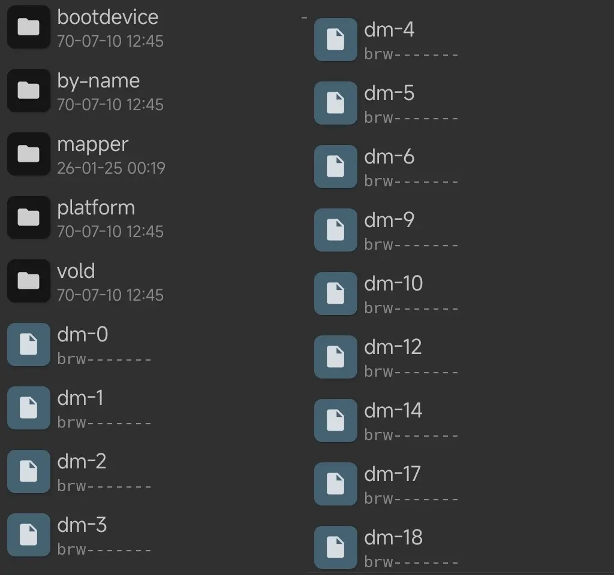
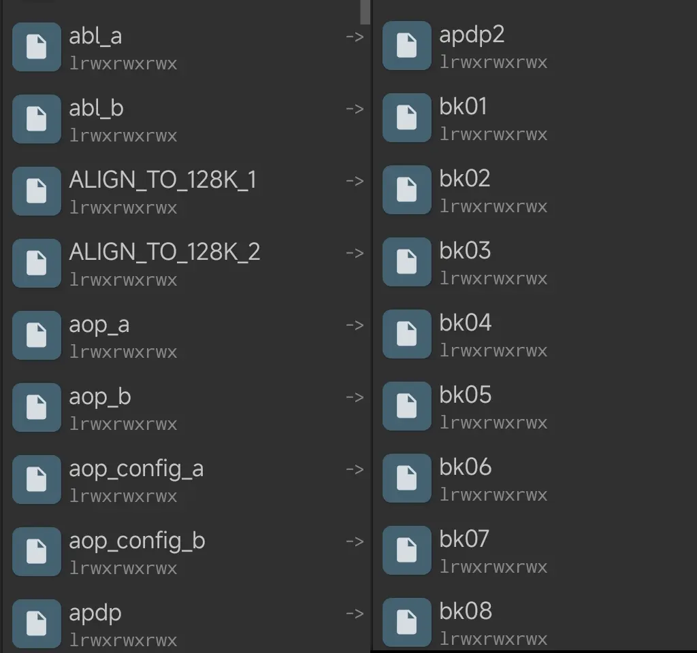
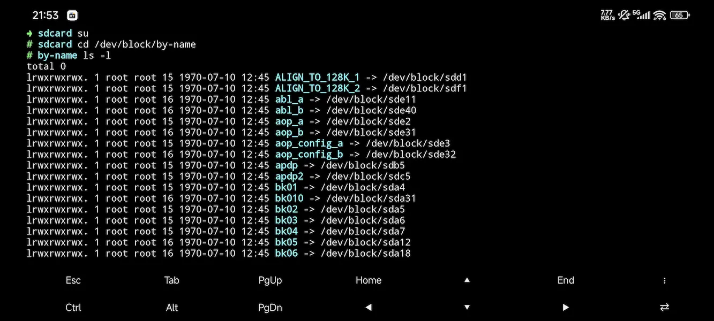

# dd 命令教学 - 从入门到精通

> [!warning]
> 此为进阶内容，你最好有命令行经验！

`dd` 是 Linux 系统的重要命令。它可以将一个文件的部分或者全部复制到另一个文件中。

> [!note]
> Q: 那磁盘呢？
>
> A: 在 Linux 中，磁盘也算是一个文件（万物皆为文件），因此也可以被 `dd` 读写。

> [!note]
> Q: Android 要怎么使用这个命令？
>
> A: Android 基于 Linux 做修改，因此 `dd` 的用法和 Linux 大同小异。对于本文的大部分场景，建议获取 `Root 权限` 后操作。
>
> 也就是说需要做两件事：
>
> 1. 为你的终端模拟器（比如 MT管理器 和 MT终端扩展包 ）授予 Root 权限。
>
> 2. 在终端输入命令 `su` 切换到 Root 用户。

## 命令解析

1. 命令格式： `dd if=<a_file> of=<another_file> [optional_parameters]`

    上面的命令格式说的是：

    - `if=<a_file>` 输入文件的路径，翻译成人话就是“从【这个文件】读取”

    - `of=<another_file>` 输出文件的路径，翻译成人话就是“输出到【这个文件】”

    - `[optional_parameters]` 可选参数：

        - bs: 同时设置读写块大小（字节）。

        - ibs/obs: 分别设置读入/写出块大小。

        - count: 指定复制的块数。

        - skip/seek: 跳过输入/输出文件的块数。

        - conv: 数据转换选项，如 ucase（小写转大写）、notrunc（不截断输出文件）。

2. 命令输出：
   指示读写的块数量。比如：
   ```text
    0+1 records in
    0+1 records out
    13 Bytes（13 B）copied，12.1558 s，0.0 KB/s 
   ```
   数字 0+1 的含义参考这里：[Stack Exchange](https://unix.stackexchange.com/questions/238482/what-does-the-two-numbers-mean-respectively-in-dds-ab-records-stats?noredirect=1&lq=1)，网页加载时间可能会比较久。

   如果两个数字都是 0 ，说明没有数据被读写，你的读写操作被拒绝了。

## 那么......磁盘在哪儿？

Android 系统的块设备可以在 `/dev/block` 目录（根目录下的 `dev` 文件夹当中的 `block` 文件夹）找到。
打开之后你会发现全是奇怪的符号：



事实上，为了简单，可以点进上图中的 `by-name` 目录：



会发现名字变得熟悉了些。这就是 Android 为了方便提供的“快捷方式”。

> [!warning]
> 有些时候 `by-name` 目录提供的友好名称可能不准确。
> 
> 输入下面的命令查看它们实际上映射的分区，方便进一步操作：
> 
> ```bash
> su
> cd /dev/block/by-name
> ls -l
> ```
>
> 也就是这样：
>
> 

知道了分区名称就可以方便的备份和还原特定的分区了。

## 使用示例

无论操作是什么，都建议先确定活动插槽：

```bash
getprop ro.boot.slot_suffix
```

返回值应该是 `_a` 或者 `_b`。如果是前者，说明现在在 `A槽` ，如果是后者，则说明在 `B槽` 。

根据活动槽位选择分区进行操作。

1. 备份**活动插槽**的 `boot` 分区到 **内置存储空间根目录** 的 boot_backup.img

A槽：

```bash
su
dd if=/dev/block/by-name/boot_a of=/sdcard/boot_backup.img
```

B槽：

```bash
su
dd if=/dev/block/by-name/boot_b of=/sdcard/boot_backup.img
```

2. 刷写 Recovery 分区，假定**内置存储空间根目录**有个叫做 `twrp.img` 的镜像。

A槽：

```bash
su
dd if=/sdcard/twrp.img of=/dev/block/by-name/recovery_a
```

B槽：

```bash
su
dd if=/sdcard/twrp.img of=/dev/block/by-name/recovery_a
```

3. 鉴别格机脚本

观察到某段脚本存在下面的代码：

```bash
dd if=/dev/zero of=/dev/sda
```

或者

```bash
dd if=/dev/urandom of=/dev/sda
```

> [!danger]
> 不管 `of=` 后跟随的是什么，只要 `if=/dev/zero` 或者 `if=/dev/urandom`，那么这条命令就是用来写入一些无意义的数据来填充目标文件。
>
> `sda` 是全盘，因此第一条示例命令使用数据0填充全盘内容。第二条示例命令使用随机值填充全盘内容。
>
> 碰到这样的代码时请多加小心。

> [!note]
> 也有人将来自 `zero` 和 `urandom` 的数据用于测速。
>
> 比如下面的命令：
>
> ```bash
> dd if=/dev/zero of=/data/tmp/testfile bs=1M
> ```
>
> 它在 `/data/tmp` 写入一个大小为 1MiB 的测试文件。用来测试写入性能。
>
> 通过命令执行耗时可以推断写入速度。