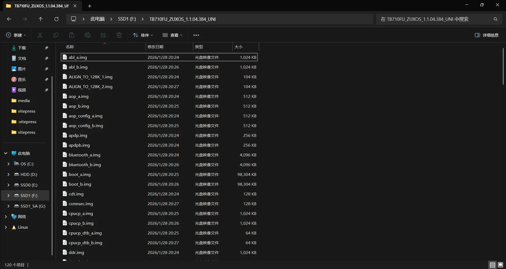

# 如何制作通用救砖包？

**不要再看本篇教程了，作者已经受不了一些指责跑路了。**

> [!danger]
> 通用刷机包不能替代全分区回读！

> [!warning]
> 自制的救砖包可能包含存在问题的镜像，例如被 Root实现 修改过的 `boot` 分区镜像。
>
> 制作前确定你的备份不包含这些问题镜像。

> [!danger]
> 通用包中不应当包括以下内容：
>
> 1. 和设备密切相关且唯一的信息，例如**序列号** 和 **谷歌锁**。
>
> 2. 用户数据分区，包括 `userdata` 分区和为它提供加密的 `metadata` 分区。
>
> 3. 有害其他设备的内容，例如错误的 `回滚指数`。通用救砖包是为社区服务的，如果不能接受请谅解并退出教程。

本节指导你将含有若干不合适分区的自制备份转化成和联想提供的官方救砖包刷入相同分区（一个不多一个不少）的操作。
按照此方法制作的包刷入时不会清除用户数据。

## 初步处理镜像集

> [!tip]
> 推荐准备一个批量重命名工具，例如 `Microsoft Powertoys` 的 `PowerRename` ，或者著名搜索工具 `Everything` 。

首先得到一个从设备回读的、你知道 `你需要制作通用包的系统所处槽位` 的备份包，就像下面这样：

如果你不知道槽位，出门右转重新读一份。

1. 删除不活动槽位的镜像

我需要制作的系统在 `A槽` ，因此删掉所有后缀为 `_b.img` 的镜像。

如果你的系统在 `B槽` ，就删掉所有后缀为 `_a.img` 的镜像。

> [!note]
> 如果你开启了 "隐藏已知文件类型的扩展名" ，那么看到的后缀就是 `_a` 或者 `_b` 。

2. 重命名剩余镜像

将**所有文件名格式为 "PartitionName_Slot.img" 的镜像**重命名为 "PartitionName.img"。

例如将 "abl_a.img" 重命名为 "abl.img"。

## 添加 XML

从官方刷机包提取 `patch.xml` 放到备份镜像所在的文件夹。

自己修改回读的 XML ，具体来讲它应当指导刷入以下镜像：
- abl
- aop
- aop_config
- apdp / apdpb
- bluetooth
- boot
- cpucp
- cpucp_dtb
- ddr
- devcfg
- dsp
- dtbo
- featenabler
- hyp
- imagefv
- init_boot
- keymaster
- logfs
- modem
- multiimgoem
- multiimgqti
- pvmfw
- qupfw
- recovery
- secdata
- shrm
- spu_service
- storsec
- super
- toolsfv
- tz
- uefi
- uefisecapp
- vbmeta
- vbmeta_system
- vendor_boot
- xbl
- xbl_config
- xbl_ramdump
- 全部以 gpt 开头的文件

## 后处理

1. 删除上面没有包含的镜像，具体来说应该是下面的这些镜像：

> - cdt
> - connsec
> - devinfo
> - dpm
> - frp
> - fsc
> - fsg
> - keystore
> - lenovolock
> - modemst1
> - modemst2
> - persist
> - proinfo
> - pstoredump
> - qmcs
> - qweslicstore
> - spunvm
> - ssd
> - tzsc
> - vm-bootsys
> - vm-persist
> - xbl_sc_logs
> - xbl_sc_test_mode

2. 放入引导文件 `xbl_s_devprg_ns.melf` 。

3. （可选）放入刷机工具。

4. 打包。